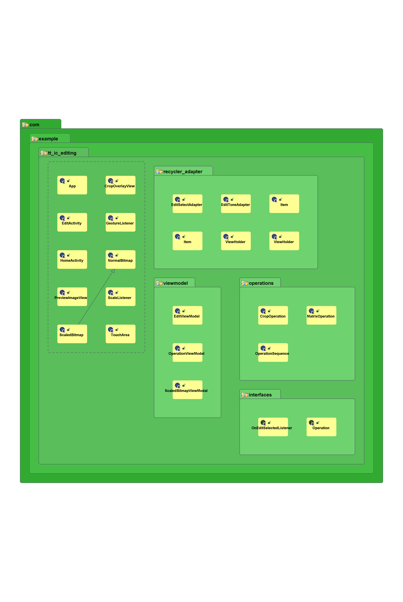
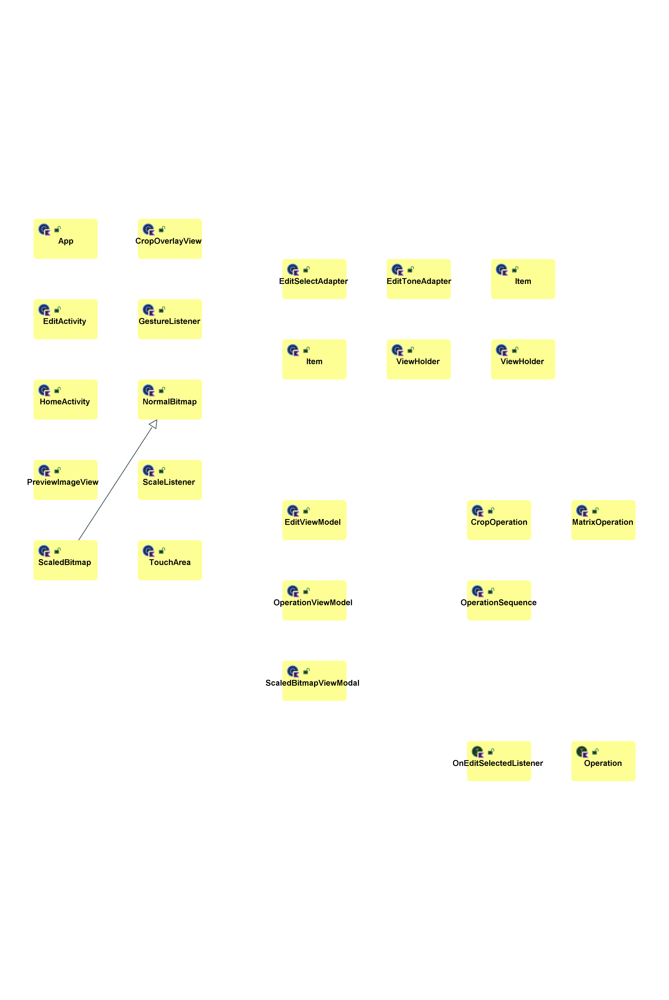
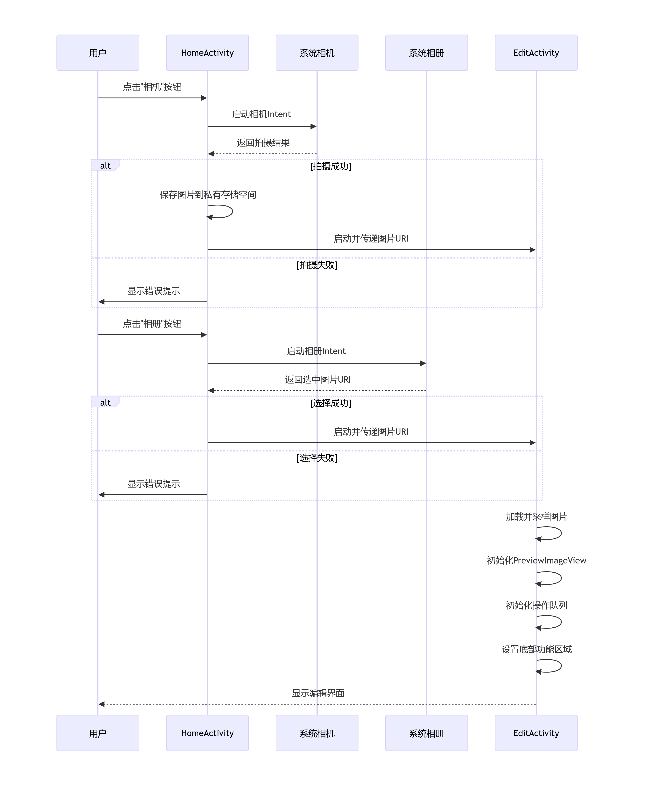

字节跳动 2025 客户端工程训练营 TT-IC-Editing

使用 Android studio 基于 Kotlin/Java 语言进行开发，未使用第三方库。

测试设备：Redmi K30 5G、Oneplus 9R

## 结构

### HomeActivity

为应用入口，选取图片来源。图片来源可以通过**相机**拍摄，或**相册**选取。

**相机**拍摄通过调用系统相机进行拍摄，拍摄成功将图片保存在**私有存储空间**，不成功则返回并提示。

**相册**选取只选取相册内图片文件，无需申请外置存储空间的读取权限。无法选择或选择后加载错误同样返回并提示。

获取到图片的 URI 后将其通过 intent 传递给图像编辑的 **EditActivity**。

### EditActivity

采用 `constraintlayout` 布局

#### 顶部

有**返回**和**保存**按钮，提供返回上一层和保存编辑后最终图片的功能。

#### 中部

中间区域用于待编辑图像的预览和编辑操作，通过继承 `ImageView` 类的 `PreviewImageView` 类自定义实现。

使用 `FrameLayout` 布局，在 `PreviewImageView` 上叠加了继承自 `View` 裁剪选框 `CropOverlayView` 的自定义类，用于裁剪区域的选择。叠加了完成裁剪的按钮。

平移缩放的预览通过 `ImageView` 的矩阵变换实现，避免了对图片的修改。

为应对**大尺寸**的图像编辑，为加快预览和操作速度，**重新采样**原图，使用**较小尺寸**的图片替代原图进行编辑操作。

同时使用**操作队列**记录中间步骤。在最后结束保存时将操作**重制**到原图上。最终保存可以通过多线程操作避免卡顿，但未完成。

#### 底部

底部为功能选择区，使用了两个 **RecyclerView** 用于编辑功能选择与设定控件的放置。

其中最底部区域为功能（如裁剪、旋转）的选择。

其上区域为各个功能的参数设定区，布局通过功能的选择动态更新。

动态更新通过 `Adapter` 和相应 `ViewHolder` 的**回调**完成。

Adapter 结构为

- EditSelectAdapter

  最底部用于功能的选择，动态更新上方参数选择与设定的 `View`。

  - EditCropAdapter
  
    提供图片裁剪功能选择。进入时显示出裁剪框，退出裁剪模式时隐藏裁剪框。
  
  - EditRotateAdapter
  
    提供图片旋转功能选择。
  
  - EditLuminanceAdapter
  
    提供图片亮度调整功能选择。
  
  - EditContrastAdapter
  
    提供图片对比度调整功能选择。
  
  - EditFilterAdapter
  
    提供图片滤镜功能选择（未完成）。
  
  - EditStickerAdapter
  
    提供图片贴图功能选择（未完成）。
  
  - EditTextEffectAdapter
  
    提供文本效果功能选择（未完成）。

## 类图

Code Iris 生成

## 时序图

## 适配

布局设计主要使用 `constraintlayout`。尽量避免使用具体尺寸参数，而是使用比例参数动态适应不同尺寸的设备。

通过 `layout` 和 `layout-land` 设配横竖屏模式。对于竖屏基本为垂直布局。对于横屏，在对宽度切分后进行垂直布局。动态更新布局时需要通过查询 `orientation` 处理布局约束关系的改变。

通过 `values` 和 `values-night` 定义日夜间模式不同的属性值。可以在系统切换日夜间模式时自动应用。

由于采用传统销毁重建的方式更新布局，使用 `ViewModel` 来保存状态数据，如不同功能的参数选择和最终的操作队列。

## 总结

首次进行具有产品意义 `Android` 应用的开发，学习了不少。

首先是架构设计，因为是第一次做这种应用，缺乏全局观，不能很好的自上而下的设计架构。基本是走一步看一步，哪里需要什么就添砖加瓦，到后面代码结构就歪歪扭扭了。重构一下应该会好不少。

遇到的第一个挑战是界面设计，前几天刚学习完 `Android` 的 UI。对于哪里用哪些布局还不是很确定，同时又考虑横竖屏适配，来来回回也折腾不少时间。另外为了适配日夜间模式，需要修改各种属性。但有些属性是系统管理的，又有些属性是历史性的，到现在还没完全弄明白对应的属性有哪些。

第二个是图像变换操作的存储。原本设计的是将所有操作保存为一个序列，可以同时用于预览和最终保存。但有的操作似乎不能是简单的叠加，比如经过裁剪后图像尺寸的改变会使得后续变换的矩阵尺寸的改变，不能保持无破坏预览了。

期间也使用过 AI 进行建议，但 AI 给的不一定安全，甚至还出现了内存泄漏。但作为思路的提供还是有不少帮助。当然也看到有人直接 Vibe coding 了一整套项目，但感觉这样出来的代码很陌生，不利于后期的维护。

最后感谢字节举办的训练营，确实收获了不少 Android 开发的经验。
